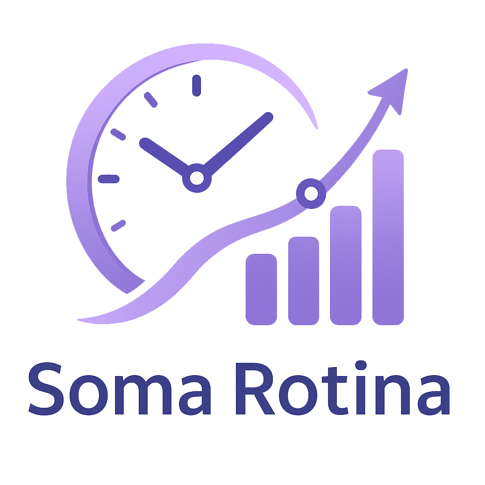

  <h1>Projeto Soma Rotina</h1> 
  
  
Projeto desenvolvido para aprimorar habilidades em desenvolvimento full-stack.

---

## Sobre o Projeto

Este projeto tem como objetivo de somar as horas gastas em alguma atividade. 
O usuário entra com os minutos relacionado com o dia da semana e nosso projeto retorna minutos totais, 
horas e a comparação com a semana anterior enviando uma mensagem motivacional ou de parabenização dependendo do resultado.

---

## Tecnologias Utilizadas

- **HTML5** – estrutura da página.
- **CSS3** – estilização personalizada.
- **TailWindCss** – framework para responsividade e componentes.
- **ReactJS** – Framework utilizado para a manipulação de componentes e requisições para o front-end.
- **Laravel** - Framework utilizado para back-end e manipulação de rotas.
- **JSON** - Arquivos utilizados para armazenar as informações requisitadas.

---

## Preview

